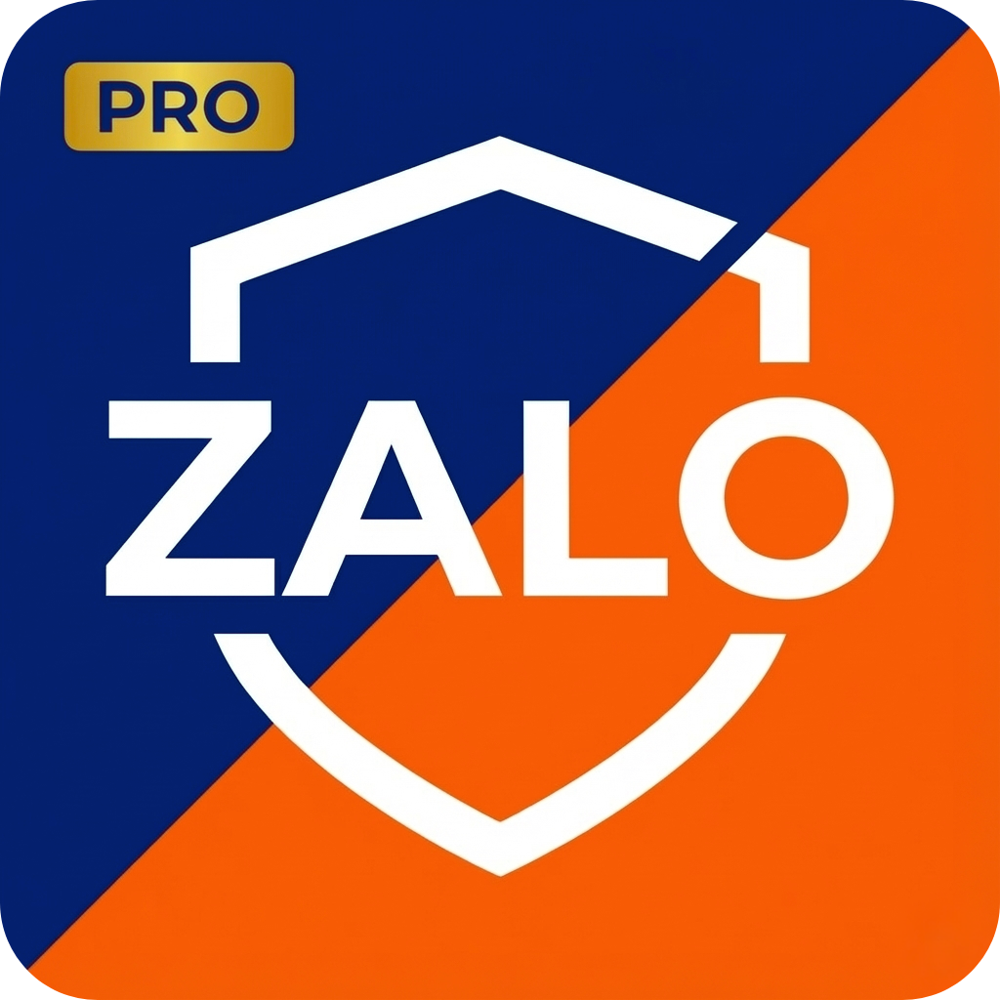

<div align="center">



# Zplus - Đăng nhập không giới hạn, Lưu trữ trọn đời 🛡️

**Phần mềm quản lý Zalo miễn phí, an toàn, hoạt động song song với Zalo PC gốc.**

_Sản phẩm được phát triển bởi Softty, hoạt động độc lập và không thuộc về Zalo Group._

[](https://github.com/LyVanBong/zalo-archive-releases/releases/latest)
[](https://github.com/LyVanBong/zalo-archive-releases/releases)
[](LICENSE)

</div>

---

Được phát triển bởi **SOFTTY.NET COMPANY LIMITED**.

## 📥 Tải xuống (Download)

- **🛡️ Local Archiving**: Tin nhắn được lưu vào Database riêng trên máy, không bao giờ mất dữ liệu ngay cả khi bị thu hồi.
- **👥 Multi-Account**: Chuyển đổi qua lại giữa nhiều tài khoản chỉ với 1 cú click. Login bằng Cookie hoặc QR.
- **🔔 Thông Báo Đa Kênh**: Tích hợp Native Notification + **Telegram Report** khi có sự kiện quan trọng (hoặc khi Build xong).
- **☁️ Cloud Build**: Hệ thống CI/CD tự động build file cài đặt cho Windows/Mac/Linux.

## 📦 Cài Đặt & Sử Dụng

### 1. Tải về và Cài đặt

1. Truy cập mục **[Releases trên GitHub](https://github.com/LyVanBong/zalo-archive-releases/releases)** để tải phiên bản mới nhất.
2. Tải file cài đặt phù hợp với máy của bạn:
   - **Windows**: `.exe`
   - **macOS**: `.dmg`
   - **Linux**: `.AppImage`
3. Cài đặt và mở ứng dụng.
4. Quét mã QR để đăng nhập (Lần đầu tiên).

### ⚠️ Lưu ý khi cài đặt (Troubleshooting)

Do phần mềm được phát triển độc lập (chưa đăng ký chứng chỉ Code Signing đắt đỏ), Windows/macOS có thể cảnh báo nhầm là "Phần mềm lạ". Đây là giải pháp:

- **Windows (SmartScreen):**
  - Nếu hiện màn hình xanh _"Windows protected your PC"_.
  - Bấm **More info** (Thêm thông tin) ➡️ Chọn **Run anyway** (Vẫn chạy).

- **macOS:**
  - Nếu báo lỗi _"App is damaged"_ hoặc _"Unidentified Developer"_.
  - Mở **Terminal** và chạy lệnh sau để cấp quyền:
    ```bash
    xattr -cr "/Applications/Zplus.app"
    ```
  - Mở lại ứng dụng bình thường.

### 2. Dành cho Lập trình viên (Developers)

```bash
# 1. Clone & Install
git clone <repo-url>
npm install

# 2. Run Dev
npm run dev

# 3. Build & Release (Tự động)
git push origin main
# (Github Actions sẽ tự build và gửi thông báo về Telegram)
```


---

© 2026 **SOFTTY.NET COMPANY LIMITED**. All rights reserved.
